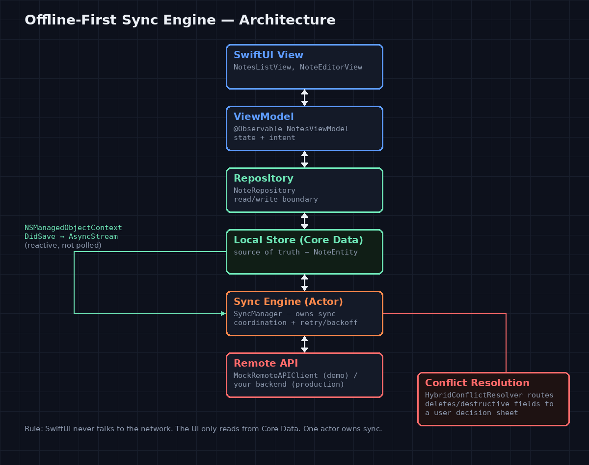

# Offline-First Sync Engine — Demo

A SwiftUI notes app that exists to make an offline-first sync engine's behavior *visible* — the retries, the backoff, the conflicts, the moment a write needs a human instead of a heuristic. Built as a runnable companion to [**Designing Offline-First Architecture with Swift Concurrency and Core Data Sync**](https://medium.com/@er.rajatlakhina/designing-offline-first-architecture-with-swift-concurrency-and-core-data-sync-46ad5008c7b5) and its accompanying library, [**offline-first-sync-engine**](https://github.com/rajatslakhina/offline-first-sync-engine).



## What it demonstrates

A real network doesn't fail on cue, so this app ships with one built in.

- **Optimistic UI** — add, edit, or delete a note and it's reflected instantly, online or not. The network is never treated as confirmation, per the article's "Aha! moment" section.
- **Network Simulator** (toolbar → wifi icon) — an offline toggle plus independent failure-rate and conflict-rate sliders, so retries/backoff/conflicts are reproducible on demand instead of waiting for a real Wi-Fi drop.
- **Per-note sync status badges** — Pending / Synced / Conflict / Failed, so the sync engine's internal state isn't a black box.
- **Conflict resolution sheet** — when the conflict resolver returns `.requiresUserDecision` (always true for deletes, per the article's "irreversible actions → user confirmation" rule), the operation is parked and surfaced here with "Keep Mine" / "Keep Server's" — the actual UI half of the article's user-intervention strategy, not just the backend logic for it.
- **Sync status banner** — idle / syncing / synced-at-time / needs-attention, driven by `SyncCoordinator`'s `AsyncStream<SyncStatus>`.

## How it's wired

`DemoApp.swift` is the composition root — one `CoreDataStack`, one `SyncManager`, one `SyncCoordinator`, assembled once at launch and handed down. Nothing downstream constructs its own instance of any of them, which is what keeps the article's rule ("SwiftUI never talks to the network," "one actor owns sync coordination") an enforced shape in code rather than a guideline someone can quietly violate three files later.

```
Demo/
  DemoApp.swift              composition root
  ViewModels/
    NotesViewModel.swift     @Observable, @MainActor — the only thing views talk to
  Views/
    NotesListView.swift      root list + toolbar (sync banner, sync-now, add)
    NoteEditorView.swift     create/edit sheet
    NetworkSimulatorView.swift   offline/failure-rate/conflict-rate controls
    ConflictResolutionView.swift the user-decision UI
    SyncStatusBadge.swift / SyncStatusBanner.swift   status display
```

The engine itself — `SyncManager`, `SyncCoordinator`, the conflict resolvers, the backoff policy — lives in the [library repo](https://github.com/rajatslakhina/offline-first-sync-engine) and is consumed here as a remote Swift Package dependency, not vendored in. `Demo.xcodeproj` depends on it via `XCRemoteSwiftPackageReference` tracking branch `main`.

## Running it

1. Open `Demo/Demo.xcodeproj` in Xcode (16.2+, iOS 17+ deployment target).
2. Let Swift Package Manager resolve `offline-first-sync-engine`.
3. Build & run on Simulator.
4. Add a few notes, then open the Network Simulator (wifi icon) and crank the failure/conflict rates up before hitting "Sync Now" to watch retries and conflicts happen live.

## Verification status — read this before trusting the build blindly

This demo was built and reviewed in a headless Linux environment with no Xcode, no macOS, and no Simulator access. Being upfront about exactly what that does and doesn't cover:

- **What was verified by actually running it**: the engine's core logic (`SyncEngineCore` — the actor, retry/backoff, all three conflict resolvers, the reactive coordinator) has a **21/21 passing test suite**, run against a real Swift 5.10.1 toolchain. That's the part of this system where a bug would be genuinely hard to find by reading — actor scheduling and retry-timing edge cases benefit the most from actually being executed, and they were.
- **What was NOT compiled**: everything in this repo — the entire SwiftUI layer, the Xcode project itself, the Core Data model integration. `import SwiftUI` and `import CoreData` don't resolve outside Xcode/macOS, so none of it could be built or run here.
- **What substituted for a real build**: full manual read-through of every view and view-model against common SwiftUI/Core Data crash classes (force-unwraps, unchecked array indexing, retain cycles in closures capturing `self`), a scripted brace/paren/bracket balance check across all 25 `.swift` files in both repos (all balanced), and a hand-validated `project.pbxproj` (balanced braces/parens) with a committed shared scheme (`Demo.xcscheme`, XML-validated).
- **The honest ceiling**: "compiles cleanly and passes 21 tests for the core sync engine, plus a careful static review of the UI layer" — not "confirmed to build and run in Xcode." That confirmation needs a human with Xcode. If you hit a compiler error on first open, it's most likely to be in the SwiftUI/Core Data layer described above, not the sync engine itself.

## Source

Built as a companion to [Rajat S. Lakhina, "Designing Offline-First Architecture with Swift Concurrency and Core Data Sync"](https://medium.com/@er.rajatlakhina/designing-offline-first-architecture-with-swift-concurrency-and-core-data-sync-46ad5008c7b5) (Medium, Dec 2025). This is an independent implementation of the architecture described there, not a code excerpt from the article.
